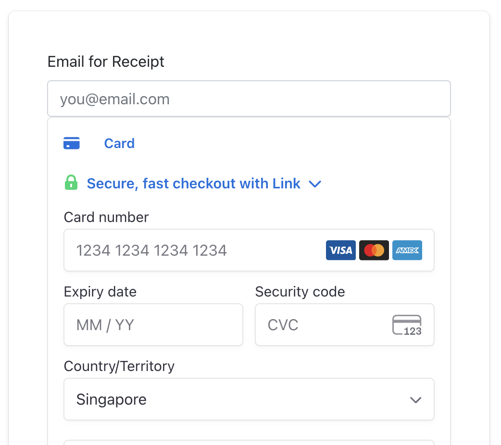

# E-commerce Demo App Using Stripe Elements 

This is a simple e-commerce demo application that a customer can use to purchase a book, using Stripe Elements. This demo uses the more customizable and lower-level PaymentIntents API to charge the customer. 

The demo also serves as sample code for reference. This is not production ready code. Its main purpose is for developers to understand the core Stripe integrations quickly. 


## Application overview
This demo is written in Python with the [Flask framework](https://flask.palletsprojects.com/). We're using the [Bootstrap](https://getbootstrap.com/docs/4.6/getting-started/introduction/) CSS framework. 

You'll need to retrieve a set of testmode API keys from the Stripe dashboard (you can create a free test account [here](https://dashboard.stripe.com/register)) to run this locally.

To simplify this project, we're also not using any database here, either. Instead `app.py` includes a simple case statement to read the GET params for `item`. 

This project has been cloned and then modified based this [original](https://github.com/marko-stripe/sa-takehome-project-python).


## Stripe Components

Stripe Elements is a set of prebuilt UI components for building a web checkout flow. It’s available as a feature of Stripe.js, a library for building payment flows. Stripe.js tokenizes sensitive payment details within an Element and allow direct payments request to Stripe without passing via a server. Benefits of Elements are as follow;

- Customizable components - Choose the elements you need and match them to the look and feel of your site 
- Optimized for coversions - Save development time and eliminate user confusion with built-in accessibility, error messages, input masking, autofill, and more
- Unlock new markets- Reach more users with 40+ payment methods through a single integration. Easily run A/B tests and manage payment methods from the Dashboard.
- Help Keep Payment safe- Stripe’s platform meets industry certification standards to help reduce compliance burdens for your business.

Payment Intents API to build an integration that can handle complex payment flows with a status that changes over the PaymentIntent’s lifecycle. It tracks a payment from creation through checkout, and triggers additional authentication steps when required.Some advantages of using the Payment Intents API include:

- Automatic authentication handling
- No double charges
- No idempotency key issues
- Support for Strong Customer Authentication (SCA) and similar regulatory changes

## Application Architecture

<p align="center">

</p>

Note that:
- A client secret is generated by Stripe for each PaymentIntent and passed to the client to use with the Publishable key to authenticate the payment request
- The payment request never goes to the app server, it goes directly from the client to Stripe

## Set Up Instructions
To get started, clone the repository and run pip3 to install dependencies:

```
git clone https://github.com/marko-stripe/sa-takehome-project-python && cd sa-takehome-project-python
pip3 install -r requirements.txt
```

Rename `sample.env` to `.env` and populate it with your Stripe account's test API keys. Find your stripe keys in the Api Keys section of your [account](https://dashboard.stripe.com/test/apikeys)

Then run the application locally:

```
flask run
```

Navigate to [http://localhost:5000](http://localhost:5000) to view the index page.

<p align="center">

</p>

To test out the workflow of the Stripe API call you will to purchase a book and checkout. Select the card option, paynow is not yet integrated. 

<p align="center">

</p>

Fill out the test credit card details and your email. and you can find the full list of test [cards](https://stripe.com/docs/testing) here. Below is a sample for fast access. Saving your information for future checkouts is not working at the moment. 

```
Number : 4242424242424242
CVC: Any 3 digits
Expiry Date: Any Future Date

```
## Folder and File Structure
- The flask backend server app is ./app.py. It functions as the web server, rendering with web pages and doing the redirects. It makes actual Payment Intent request to Stripe after receiving the order information from the front end.  
- The frontend scripts (client-side) are stored in the ./public/js folder. The main JS script is custom.js where the the order is made to the app server and then a payment request is made directly to Stripe.
- Frontend web pages are stored in the ./views folder. Stripe Elements is implented in ./views/checkout.html. Once payment is completed, users are re-directed to the success page ./views/success.html. 
- All CSS templates are stored in the ./public/css folder with little-to-no modifications. 


## Approach to this assignment & Potential improvements

How I approach this problem as a SA take home assignment and how will improve this app are on a separate google docs: https://docs.google.com/document/d/1SGrDoTx1g2g3x_GMIvY0wKmUqe8wypyEWE6hTT8MZlc/edit?usp=sharing 